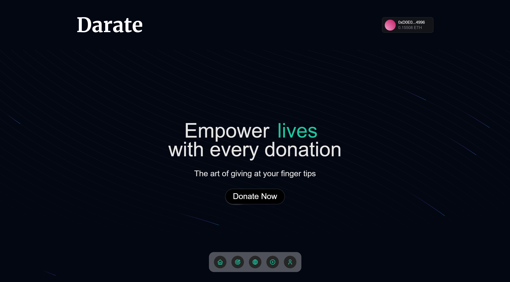

# Darate - The Art of Giving 🎨💙

[Live Site](https://darate.vercel.app), 
[Video demo](https://www.youtube.com/watch?v=XEuuiLKsqCE),
[Smart Contracts (Github)](https://github.com/AfolabiOlajide/darate-contracts)

Welcome to Darate, a decentralized donation platform designed to empower individuals and non-profit organizations to create campaigns and receive cryptocurrency donations. Built on blockchain technology, Darate ensures security, transparency, and trust for donors and recipients alike.

## 🌟 Features
1.  Create Campaigns or Organizations
    - Seamlessly create campaigns or establish organizations for various causes.
    - Empower your projects with tools to attract donors and share your mission.
2. Crypto Donations
    - Enable contributors to donate cryptocurrency securely.
    - Harness the transparency and efficiency of blockchain transactions.
3. Category-Specific Campaigns
    - Organize campaigns across diverse categories:
        - Health
        - Education
        - Technology
        - Nature
        - Tailored themes for each category to engage donors effectively.
4. Powered by Request Network
    - Leverage decentralized financial tools for invoicing and transparent tracking of funds.
    - A censorship-resistant platform ensuring seamless crypto donations.
5. Engaging User Interface
    - Modern, dynamic UI designed for effortless navigation.
    - Vibrant gradients and interactive animations bring campaigns to life.

## 🚀 Technologies
- Frontend: Next.js with TailwindCSS for sleek design and performance.
- Blockchain: Powered by Solidity Smart Contract (currently deployed on Sepolia ETH )
- Utilities: [Thirdweb](https://thirdweb.com/) for Ethereum wallet and blockchain interactions, [Request Network](https://docs.request.network/) for secure and transparent invoice creation, [Aceternity UI](https://ui.aceternity.com/) for sleek and modern UI components.

## 🎨 Acknowledgments
- Inspired by the spirit of giving and the power of blockchain.
- Special thanks to the Request Network team for their hackathon, which gave birth to this application.
- Join us in shaping the future of generosity with Darate!